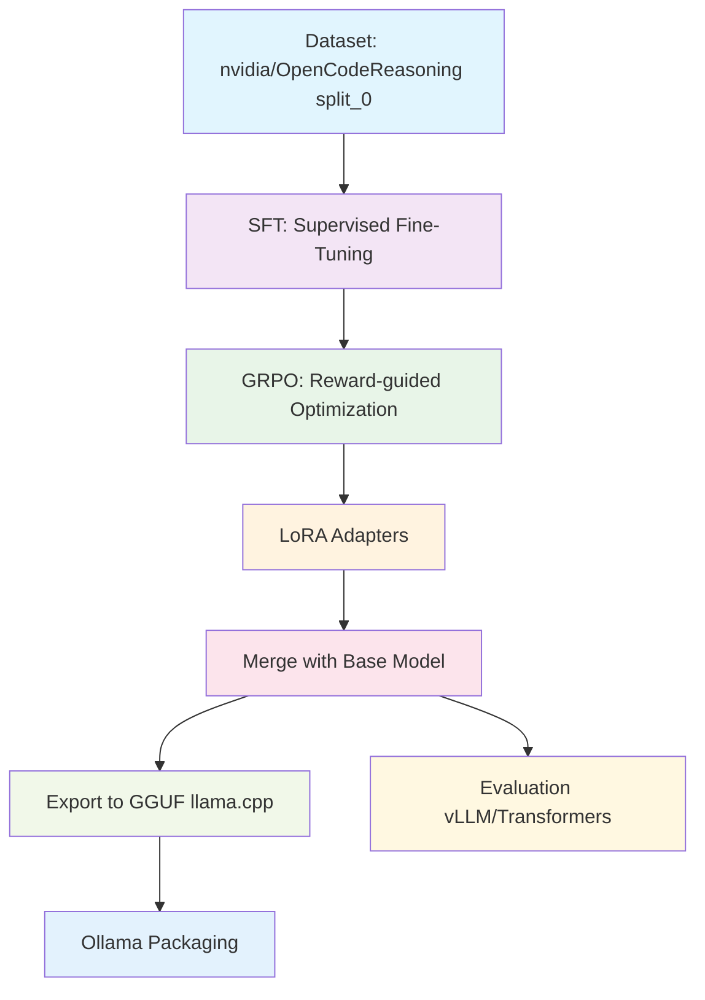

# Gwen2.5-3B Fine-tuning Overview

##  End-to-End Pipeline



##  Training Configuration

#### -  Supervised Fine-Tuning (SFT)
| Parameter | Value |
|-----------|-------|
| **Batch Size** | 1 (gradient accumulation: 2) |
| **Learning Rate** | 2e-4 |
| **Epochs** | 2 |
| **Optimizer** | AdamW 8-bit |
| **Weight Decay** | 0.01 |
| **Warmup Steps** | 5 |
| **LoRA Rank** | 32 |
| **LoRA Alpha** | 64 |
| **Target Modules** | `q_proj`, `k_proj`, `v_proj`, `o_proj`, `gate_proj`, `up_proj`, `down_proj` |

#### - Group Relative Policy Optimization (GRPO)
| Parameter | Value |
|-----------|-------|
| **Learning Rate** | 5e-5 |
| **Max Steps** | 100 |
| **Temperature** | 0.6 |
| **Generations per Step** | 4 |
| **Reward Types** | Format matching (exact/approx), Solution correctness (Gemini-2.0-flash) |
| **Context Length** | 32k tokens |
| **Precision** | 16-bit |

###  Hardware Requirements
- **Primary**: A100 40GB
- **Alternative**: Fits on smaller GPUs (like the T4 on GoogleColab)

##  Results (LiveCodeBench Evaluation)

| Model | Pass@1 | Pass@5 | Easy Pass@1 | Medium Pass@1 | Hard Pass@1 |
|-------|:------:|:------:|:-----------:|:-------------:|:-----------:|
| **Fine-tuned Model** | **18.85%** | **28.00%** | **42.39%** | **9.05%** | **0.00%** |
|  Base Qwen2.5-3B | 15.85% | 21.75% | 31.27% | 11.31% | 0.00% |
| **Improvement** | **+3.00%** | **+7.25%** | **+11.12%** | **-2.26%** | **±0.00%** |

### Performance Highlights
-  **Overall Pass@1**: 3% improvement over base model
-  **Pass@5**: 7.25% improvement in multi-attempt scenarios  
-  **Easy Problems**: Significant 11.12% boost in accuracy
- ⚠️ **Medium Problems**: Slight 2.26% decrease (potential overfitting to easy cases)
-  **Hard Problems**: No successful solutions (both models)

## Auto hyperparameter recommendations

An optional helper was added to automatically recommend conservative changes to
learning rate, gradient accumulation, and warmup steps based on the dataset
size. It is implemented in `gwen25/pipelines/hyperparams.py` and can be enabled
when running the fine-tuning notebook or script by setting the environment
variable `AUTO_HPARAMS=1`.

Example usage (opt-in):

```
# Enable suggestions; the script will print recommended LR / accum / warmup
AUTO_HPARAMS=1 python gwen25/notebooks/finetuning.py
```

Notes:
- The recommendation is heuristic and conservative; it's intended to avoid
    obvious instability (too-large LR for large datasets) and to suggest
    reasonable effective batch sizes when memory is limited.
- For best results, treat these as starting points and run short validation
    sweeps when possible. See references in the module for rationale.

